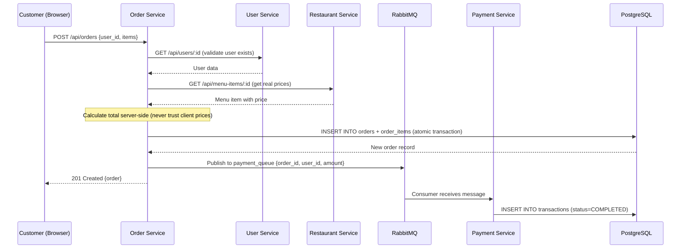

# FoodieGo — Complete Team Project Guide

> **Audience:** All 6 team members. Read this before the project discussion.
> **Goal:** Understand every piece of the system — what it is, why it exists, and how to run it.

---

## 1. What Is This Project?

FoodieGo is a **food delivery web application** built as a cloud computing project. It demonstrates:

- **Microservices architecture** (4 independent backend services)
- **Containerization** with Docker (3 separate environments)
- **Orchestration** with Kubernetes (Minikube)
- **Asynchronous messaging** with RabbitMQ
- **Monitoring** with Prometheus + Grafana + cAdvisor

A customer browses restaurants, adds food to a cart, places an order, and the system automatically processes payment via an async message queue.

---

## 2. Tech Stack

| Layer | Technology | Why |
|---|---|---|
| **Backend** | Node.js 20 + Express 4 | Lightweight, async I/O, perfect for microservices |
| **Frontend** | React 18 + Vite 5 + CSS | Modern SPA framework, fast dev server |
| **Database** | PostgreSQL 16 | Reliable RDBMS, supports schemas for service isolation |
| **Auth** | JWT + bcryptjs | Stateless auth — no server-side sessions needed |
| **Sync Comms** | axios (REST) | Services call each other via HTTP |
| **Async Comms** | RabbitMQ | Order→Payment decoupled via message queue |
| **Monitoring** | Prometheus + Grafana + cAdvisor | Metrics collection, dashboards, container stats |
| **Containers** | Docker + Docker Compose v2 | Reproducible environments |
| **Orchestration** | Kubernetes (Minikube) | Production-like cluster on a local machine |

---

## 3. Folder Structure

```
food-delivery-system/
├── .env / .env.example       # Environment variables (secrets, DB creds)
├── README.md                 # Quick-start instructions
├── TECHNICAL_ARCHITECTURE.md # Design decisions deep-dive
├── setup_env.sh              # One-click Ubuntu dependency installer
│
├── database/
│   ├── Dockerfile            # Custom Postgres image (2 lines)
│   └── init.sql              # Schema creation + seed data (135 lines)
│
├── services/
│   ├── user-service/         # Port 3001 — auth, registration, profiles
│   ├── restaurant-service/   # Port 3002 — restaurants + menus
│   ├── order-service/        # Port 3003 — order lifecycle + RabbitMQ producer
│   └── payment-service/      # Port 3004 — payment processing + RabbitMQ consumer
│
├── frontend/                 # React SPA + nginx config for production
│   ├── Dockerfile            # 3-stage build (dev → build → nginx)
│   ├── nginx.conf            # Reverse proxy config
│   └── src/                  # React components, pages, contexts
│
├── docker-compose.dev.yml    # Development environment (hot-reload)
├── docker-compose.test.yml   # Testing environment (isolated DB)
├── docker-compose.prod.yml   # Production environment (nginx, no mounts)
│
├── k8s/                      # 21 Kubernetes manifest files
├── prometheus/               # Prometheus scrape config
└── tests/e2e/                # End-to-end test suite
```

---

## 4. The Four Microservices — Explained

Each service follows the **same internal structure**:

```
service-name/
├── Dockerfile          # Multi-stage Docker build
├── package.json        # Dependencies + scripts
├── src/
│   ├── index.js        # Entry point — starts Express server
│   ├── app.js          # Express app — middleware + routes + error handler
│   ├── config.js       # Environment variable reader
│   ├── db.js           # PostgreSQL connection pool
│   ├── rabbitmq.js     # (order + payment only) RabbitMQ connection
│   ├── routes/         # API route handlers
│   └── middleware/     # (user-service only) JWT auth middleware
└── tests/              # Jest unit tests
```

### 4.1 User Service (port 3001)

**Purpose:** Registration, login, JWT tokens, profile management.

| Endpoint | Method | Description |
|---|---|---|
| `/api/users/register` | POST | Create account (customer, owner, or driver) |
| `/api/users/login` | POST | Returns JWT token |
| `/api/users/me` | GET/PUT | View/update profile (requires JWT) |
| `/api/users/:id` | GET | Internal lookup (used by order-service) |
| `/api/users/drivers` | GET | List delivery drivers |
| `/health` | GET | Returns `{"status":"ok"}` |

**Key logic:** When a `restaurant_owner` registers, the service also calls restaurant-service to auto-create their restaurant.

### 4.2 Restaurant Service (port 3002)

**Purpose:** Restaurant listings, menu item CRUD.

| Endpoint | Method | Description |
|---|---|---|
| `/api/restaurants` | GET/POST | List all / create new |
| `/api/restaurants/:id` | GET/PUT | View / update restaurant |
| `/api/restaurants/:id/menu` | GET/POST | List / add menu items |
| `/api/menu-items/:id` | GET/PUT/DELETE | Single menu item CRUD |
| `/health` | GET | Health check |

### 4.3 Order Service (port 3003)

**Purpose:** The "brain" of the system. Coordinates user validation, price calculation, and payment triggering.

| Endpoint | Method | Description |
|---|---|---|
| `/api/orders` | POST | Place order (triggers RabbitMQ message) |
| `/api/orders/:id` | GET | Get order details |
| `/api/orders/user/:userId` | GET | Customer's order history |
| `/api/orders/restaurant/:id` | GET | Restaurant's incoming orders |
| `/api/orders/driver/:driverId` | GET | Driver's assigned orders |
| `/api/orders/:id/status` | PATCH | Update status (forward-only) |
| `/api/orders/:id/assign` | PATCH | Assign a delivery driver |
| `/health` | GET | Health check |

**Order status state machine** (can only move forward):
```
PLACED → ACCEPTED → PREPARING → OUT_FOR_DELIVERY → DELIVERED
```

### 4.4 Payment Service (port 3004)

**Purpose:** Records payment transactions. Consumes messages from RabbitMQ.

| Endpoint | Method | Description |
|---|---|---|
| `/api/payments` | POST | Record payment manually |
| `/api/payments/order/:orderId` | GET | Payment status for an order |
| `/api/payments/user/:userId` | GET | User's payment history |
| `/health` | GET | Health check |

---

## 5. The Order Flow (Most Important!)

This is the critical path you should understand for the discussion:



**Key design decisions:**
- Prices are **always** fetched from the database, never from the client (fraud prevention)
- Payment is **asynchronous** via RabbitMQ (decoupled from order placement)
- Failed messages go to a **Dead Letter Queue** for manual review

---

## 6. Database Design

One PostgreSQL instance, **4 schemas** (one per service to simulate database-per-service):

```
┌─────────────────────────────────────────────────────┐
│                PostgreSQL Instance                   │
├──────────────┬──────────────┬───────────┬────────────┤
│  user_svc    │restaurant_svc│ order_svc │payment_svc │
├──────────────┼──────────────┼───────────┼────────────┤
│ users        │ restaurants  │ orders    │transactions│
│  - id        │  - id        │  - id     │  - id      │
│  - name      │  - name      │  - user_id│  - order_id│
│  - email     │  - cuisine   │  - status │  - user_id │
│  - password  │  - rating    │  - total  │  - amount  │
│  - role      │              │  - driver │  - method  │
│  - rest_id   │ menu_items   │           │  - status  │
│              │  - id        │order_items│            │
│              │  - name      │  - id     │            │
│              │  - price     │  - name   │            │
│              │  - available │  - price  │            │
│              │              │  - qty    │            │
└──────────────┴──────────────┴───────────┴────────────┘
```

**Seed data** (auto-loaded on first start):
- 4 restaurants (Burger Palace, Sushi Haven, Pizza Roma, Spice Garden)
- 9 menu items across all restaurants
- 4 restaurant owner accounts (password: `owner123`)
- 2 delivery driver accounts (password: `driver123`)

---

## 7. Docker Compose — Three Environments Compared

This is a critical topic. Here's why we have 3 files and what makes each one different:

| Feature | `dev` | `test` | `prod` |
|---|---|---|---|
| **Purpose** | Local development | Run automated tests | Production simulation |
| **Project name** | `food-delivery-dev` | `food-delivery-test` | (default) |
| **Hot-reload** | ✅ nodemon watches files | ❌ | ❌ |
| **Source mounts** | ✅ `./src:/app/src` | ❌ | ❌ |
| **Service command** | `nodemon src/index.js` | `npm test` | `node src/index.js` (default) |
| **Frontend** | Vite dev server (:5173) | Vite dev server (:4173) | Nginx serves static files (:80) |
| **Service ports** | 3001-3004 (exposed) | 4001-4004 (different!) | Not exposed (internal only) |
| **Postgres port** | 5433 (host) | 5442 (host) | Not exposed |
| **Database name** | `food_delivery` | `food_delivery_test` | `food_delivery` |
| **RabbitMQ** | ✅ | ❌ | ✅ |
| **Monitoring** | ✅ Prometheus+Grafana+cAdvisor | ❌ | ✅ Prometheus+Grafana+cAdvisor |
| **Env var style** | `${VAR:-default}` (safe fallback) | `${VAR:-default}` | `${VAR:?error}` (MUST be set!) |
| **Restart policy** | None | None | `unless-stopped` |
| **Resource limits** | ✅ CPU/Memory limits | ❌ | ✅ CPU/Memory limits |
| **Build args** | `NODE_ENV: development` | (default=production) | (default=production) |
| **Network** | `food_net_dev` | `food_net_test` | `food_net_prod` |
| **Volumes** | `pgdata_dev`, etc. | `pgdata_test` | `pgdata`, etc. |

**Why different ports?** So you can run dev and test **simultaneously** without port conflicts.

**Why `${VAR:?error}` in prod?** It forces you to set secrets explicitly — prevents deploying with default passwords.

**Why separate volumes?** So dev data, test data, and prod data never overwrite each other.

---

## 8. Dockerfile Strategy — Multi-Stage Builds

Every backend service uses the same **2-stage Dockerfile**:

```dockerfile
# Stage 1: Install dependencies
FROM node:20-alpine AS deps
WORKDIR /app
COPY package*.json ./
ARG NODE_ENV=production
RUN if [ "$NODE_ENV" = "development" ]; then npm install; else npm ci --omit=dev; fi

# Stage 2: Runtime (slim image)
FROM node:20-alpine AS runtime
WORKDIR /app
ENV NODE_ENV=production
ENV PATH /app/node_modules/.bin:$PATH
COPY --from=deps /app/node_modules ./node_modules
COPY src ./src
COPY package.json ./
EXPOSE <port>
USER node
CMD ["node", "src/index.js"]
```

**Why multi-stage?**
- Stage 1 installs packages (large layer, cached)
- Stage 2 copies only what's needed (small final image ~200MB vs ~1GB)
- `USER node` — runs as non-root for security

**Why the `NODE_ENV` build arg?**
- In **dev**: passes `NODE_ENV=development` → installs devDependencies (like `nodemon`)
- In **prod**: defaults to `production` → only production dependencies

**The frontend Dockerfile is 3-stage:**
1. `builder` — install deps (used by dev compose as the target)
2. `build-stage` — runs `vite build` to create static files
3. `runtime` — copies static files into an `nginx:alpine` image

---

## 9. Kubernetes Architecture

The `k8s/` directory contains **21 manifest files** that deploy the entire system to Minikube:

### Resource Types Used

| K8s Resource | What It Does | Files |
|---|---|---|
| **Secret** | Stores sensitive data (DB password, JWT secret, RabbitMQ creds) | `00-secret.yaml` |
| **ConfigMap** | Non-sensitive config (DB host, service URLs, init.sql) | `01-configmap.yaml`, `16-prometheus-configmap.yaml` |
| **Deployment** | Defines pod templates + replica count | `02, 04, 06, 08, 10, 12, 17, 19` |
| **Service** | Network endpoint for accessing pods | `03, 05, 07, 09, 11, 13, 15, 18, 20` |
| **StatefulSet** | Like Deployment but with stable storage (for RabbitMQ) | `14-rabbitmq-statefulset.yaml` |

### Service Types

| Service | Type | Why |
|---|---|---|
| `frontend-service` | **NodePort** (30080) | Only one exposed to outside — you access the app here |
| `postgres-service` | ClusterIP | Internal only — services connect via DNS |
| `user-service` | ClusterIP | Internal — nginx proxies to it |
| `restaurant-service` | ClusterIP | Internal — nginx proxies to it |
| `order-service` | ClusterIP | Internal — nginx proxies to it |
| `payment-service` | ClusterIP | Internal — nginx proxies to it |
| `rabbitmq-service` | Headless | StatefulSet needs stable DNS |
| `prometheus-service` | ClusterIP | Internal monitoring |
| `grafana-service` | ClusterIP | Internal dashboards |

### Replicas & Health Checks

| Component | Replicas | Readiness Probe | Liveness Probe |
|---|---|---|---|
| user-service | 2 | GET /health (5s delay) | GET /health (15s delay) |
| restaurant-service | 2 | GET /health (5s delay) | GET /health (15s delay) |
| order-service | 2 | GET /health (5s delay) | GET /health (15s delay) |
| payment-service | 2 | GET /health (5s delay) | GET /health (15s delay) |
| frontend | 1 | GET / (3s delay) | GET / (10s delay) |
| postgres | 1 | — | — |
| rabbitmq | 1 | — | — |
| prometheus | 1 | — | — |
| grafana | 1 | — | — |

---

## 10. RabbitMQ — Async Messaging

### How It Works

```
Order Service                    RabbitMQ                    Payment Service
     │                              │                              │
     │── publish to ──────────────→ │                              │
     │   payment_queue              │── delivers message ────────→ │
     │   {order_id, user_id,       │                              │── INSERT INTO
     │    amount, method}           │                              │   transactions
     │                              │                              │   (COMPLETED)
     │                              │                              │
     │                        Dead Letter Queue                    │
     │                              │← nack (bad message) ────────│
```

### Key Concepts
- **Durable queue**: Messages survive RabbitMQ restarts
- **Dead Letter Exchange (DLX)**: Failed/invalid messages are routed to `payment_queue_dead` instead of being lost
- **Exponential backoff**: Both services retry connection up to 10 times with increasing delays
- **Auto-reconnect**: If connection drops, services automatically reconnect

---

## 11. Frontend Architecture

### Pages & Access Control

| Page | Path | Access | Description |
|---|---|---|---|
| Home | `/` | Guests + Customers | Restaurant grid |
| Restaurant | `/restaurant/:id` | Guests + Customers | Menu + add to cart |
| Login | `/login` | Anyone | Email + password |
| Register | `/register` | Anyone | Role selector (customer/owner) |
| Cart | `/cart` | Customers only | Review + place order |
| My Orders | `/orders` | Customers only | Order history + status |
| Dashboard | `/dashboard` | Owners only | Menu management + incoming orders |
| Deliveries | `/deliveries` | Drivers only | Assigned deliveries |
| Profile | `/profile` | Any logged-in user | Edit name, email, address, password |

### How the Frontend Talks to the Backend

- **In development**: The Vite dev server runs on port 5173
- **In production**: Nginx serves the built static files AND reverse-proxies API calls:

```
Browser → nginx:80
  /              → serves index.html (React SPA)
  /api/users/*   → proxy to user-service:3001
  /api/restaurants/* → proxy to restaurant-service:3002
  /api/orders/*  → proxy to order-service:3003
  /api/payments/* → proxy to payment-service:3004
```

---

## 12. Monitoring Stack

| Tool | Port | Purpose |
|---|---|---|
| **Prometheus** | 9090 | Scrapes metrics every 15s from services and cAdvisor |
| **Grafana** | 3000 | Visual dashboards (login: admin/admin) |
| **cAdvisor** | 8080 | Collects container CPU, memory, network stats |

---

## 13. Testing Strategy

### Unit Tests (per service)
Each service has a `tests/` folder with Jest tests:
```bash
cd services/user-service && npm test    # users.test.js
cd services/restaurant-service && npm test  # restaurants.test.js
cd services/order-service && npm test   # orders.test.js (25 tests)
cd services/payment-service && npm test # payments.test.js (26 tests)
```

### E2E Tests (full system)
`tests/e2e/run-e2e.js` runs 44 assertions against the **live Docker stack**:
- **Happy path**: Register → Login → Browse → Order → Payment → Status updates
- **Negative cases**: Duplicate email, wrong password, invalid IDs, backward status transitions, tampered JWT

```bash
# Start dev stack first, then:
node tests/e2e/run-e2e.js
```

### Docker Compose Test Environment
```bash
docker compose -f docker-compose.test.yml up --build --abort-on-container-exit
```
Runs `npm test` inside each container against an **isolated test database**.

---

## 14. Environment Variables

All configuration is done via environment variables (12-factor app):

| Variable | Where Set | Purpose |
|---|---|---|
| `POSTGRES_USER/PASSWORD/DB` | `.env` | Postgres superuser credentials |
| `DB_HOST/PORT/USER/PASSWORD/NAME` | `.env` + compose | Service DB connection |
| `JWT_SECRET` | `.env` | Token signing key |
| `RABBITMQ_DEFAULT_USER/PASS` | `.env` | RabbitMQ credentials |
| `RABBITMQ_URL` | compose | AMQP connection string |
| `USER/RESTAURANT/PAYMENT_SERVICE_URL` | compose | Inter-service REST URLs |
| `NODE_ENV` | compose | development / test / production |
| `PORT` | compose | Service listen port |

---

## 15. How to Run Everything

### Prerequisites
Run `bash setup_env.sh` OR install manually: Docker, Node.js 20, kubectl, minikube.

### Development
```bash
cp .env.example .env
docker compose -f docker-compose.dev.yml up --build
# Frontend: http://localhost:5173
# Grafana:  http://localhost:3000 (admin/admin)
# RabbitMQ: http://localhost:15672 (guest/guest)
```

### Production (Docker)
```bash
# Add to .env: RABBITMQ_DEFAULT_USER=guest, RABBITMQ_DEFAULT_PASS=guest
docker compose -f docker-compose.prod.yml up --build -d
# Frontend: http://localhost:80
```

### Kubernetes
```bash
minikube start --driver=docker
eval $(minikube docker-env)
# Build images inside minikube:
docker build -t food-delivery/user-service:latest ./services/user-service
docker build -t food-delivery/restaurant-service:latest ./services/restaurant-service
docker build -t food-delivery/order-service:latest ./services/order-service
docker build -t food-delivery/payment-service:latest ./services/payment-service
docker build -t food-delivery/frontend:latest ./frontend
docker build -t food-delivery/postgres:latest ./database
# Deploy:
kubectl apply -f k8s/
# Access:
minikube service frontend-service --url
```

---

## 16. Test Accounts

| Role | Email | Password |
|---|---|---|
| Owner (Burger Palace) | `burger@owner.com` | `owner123` |
| Owner (Sushi Haven) | `sushi@owner.com` | `owner123` |
| Owner (Pizza Roma) | `pizza@owner.com` | `owner123` |
| Owner (Spice Garden) | `spice@owner.com` | `owner123` |
| Driver 1 | `driver1@test.com` | `driver123` |
| Driver 2 | `driver2@test.com` | `driver123` |

---

## 17. Documentation Accuracy Check

I compared the existing `README.md` and `TECHNICAL_ARCHITECTURE.md` against the actual code. Key findings:

| Item | Documentation Says | Actual Code | Match? |
|---|---|---|---|
| Microservices count | 4 services | 4 services | ✅ |
| DB schemas | 3 schemas (TECHNICAL_ARCHITECTURE) | 4 schemas (user_svc, restaurant_svc, order_svc, payment_svc) | ⚠️ TECHNICAL_ARCHITECTURE says 3, README says 4 — actual is **4** |
| Payment trigger | "fire-and-forget REST call" (TECHNICAL_ARCHITECTURE) | **RabbitMQ async message** | ⚠️ TECHNICAL_ARCHITECTURE is outdated — RabbitMQ was added later |
| Order status chain | PLACED→ACCEPTED→PREPARING→DELIVERED | PLACED→ACCEPTED→PREPARING→**OUT_FOR_DELIVERY**→DELIVERED | ⚠️ TECHNICAL_ARCHITECTURE misses OUT_FOR_DELIVERY |
| User roles | customer, restaurant_owner | customer, restaurant_owner, **delivery_driver** | ⚠️ TECHNICAL_ARCHITECTURE doesn't mention delivery_driver |
| Compose files | 1 mentioned (dev) | 3 files (dev, test, prod) | ⚠️ TECHNICAL_ARCHITECTURE only mentions dev |
| RabbitMQ | Not mentioned in TECHNICAL_ARCHITECTURE | Fully implemented with DLX | ⚠️ Missing from TECHNICAL_ARCHITECTURE |
| Monitoring | Not mentioned in TECHNICAL_ARCHITECTURE | Prometheus + Grafana + cAdvisor | ⚠️ Missing from TECHNICAL_ARCHITECTURE |

> [!IMPORTANT]
> The `TECHNICAL_ARCHITECTURE.md` is **outdated**. It was written before RabbitMQ, the delivery_driver role, and the monitoring stack were added. The `README.md` is mostly accurate but should be treated as the primary reference.

---

## 18. Common Troubleshooting

| Problem | Cause | Fix |
|---|---|---|
| Services crash with "Cannot find package 'pg'" | Host `node_modules` mounted over container's | Remove `node_modules` volume mounts from compose |
| `RABBITMQ_DEFAULT_USER is required` | Prod compose requires explicit env vars | Add `RABBITMQ_DEFAULT_USER=guest` to `.env` |
| `minikube service frontend` not found | Service is named `frontend-service` | Use `minikube service frontend-service` |
| `npm ci` permission denied | Docker created `node_modules` as root | Run `sudo chown -R $USER:$USER .` |
| Postgres "data directory wrong ownership" | Volume reused between restarts | `kubectl delete pod -l app=postgres` |
| Frontend blank page in prod | Missing nginx `try_files` fallback | Check `nginx.conf` is copied in Dockerfile |
