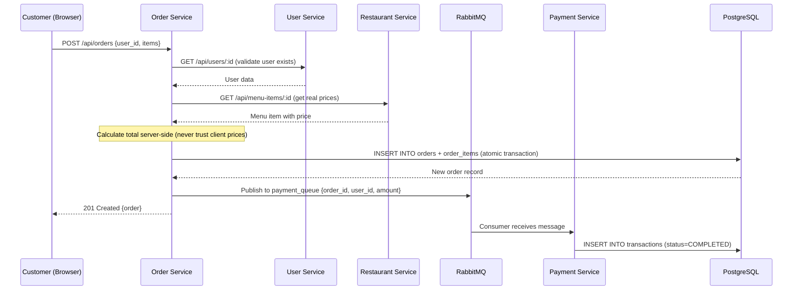

# FoodieGo — Complete Team Project Guide

> **Audience:** All team members. Read this before the project discussion.
> **Goal:** Understand every piece of the system — what it is, why it exists,
> and how to run it.

---

## 1. What Is This Project?

FoodieGo is a **food delivery web application** built as a cloud computing
project. It demonstrates:

- **Microservices architecture** (4 independent backend services)
- **Containerization** with Docker (3 separate environments)
- **Orchestration** with Kubernetes (compatible with any standard K8s cluster)
- **Asynchronous messaging** with RabbitMQ
- **Full observability** with Prometheus, Grafana, cAdvisor, kube-state-metrics,
  and prom-client

A customer browses restaurants, adds food to a cart, places an order, and the
system automatically processes payment via an async message queue.

---

## 2. Tech Stack

| Layer             | Technology                                                         | Why                                                    |
| ----------------- | ------------------------------------------------------------------ | ------------------------------------------------------ |
| **Backend**       | Node.js 20 + Express 4                                             | Lightweight, async I/O, perfect for microservices      |
| **Frontend**      | React 18 + Vite 5 + CSS                                            | Modern SPA framework, fast dev server                  |
| **Database**      | PostgreSQL 16                                                      | Reliable RDBMS, supports schemas for service isolation |
| **Auth**          | JWT + bcryptjs                                                     | Stateless auth — no server-side sessions needed        |
| **Sync Comms**    | axios (REST)                                                       | Services call each other via HTTP                      |
| **Async Comms**   | RabbitMQ                                                           | Order→Payment decoupled via message queue              |
| **Monitoring**    | Prometheus + Grafana + cAdvisor + prom-client + kube-state-metrics (K8s only) | Full-stack observability (Cluster only) |
| **Logging**       | Loki + Promtail (K8s only)                      | Centralized log collection (Cluster only) |
| **Containers**    | Docker + Docker Compose v2                                         | Reproducible environments                              |
| **Orchestration** | Kubernetes (any cluster — Minikube, K3s, cloud)                    | Production-grade container orchestration               |

---

## 3. Folder Structure

```
food-delivery-system/
├── .env / .env.example       # Environment variables (secrets, DB creds)
├── README.md                 # Quick-start instructions
├── TECHNICAL_ARCHITECTURE.md # Design decisions deep-dive
├── setup_env.sh              # One-click Ubuntu dependency installer
│
├── database/
│   ├── Dockerfile            # Custom Postgres image
│   └── init.sql              # Schema creation + seed data
│
├── services/
│   ├── user-service/         # Port 3001 — auth, registration, profiles
│   ├── restaurant-service/   # Port 3002 — restaurants + menus
│   ├── order-service/        # Port 3003 — order lifecycle + RabbitMQ producer
│   └── payment-service/      # Port 3004 — payment processing + RabbitMQ consumer
│
├── frontend/                 # React SPA + nginx config for production
│   ├── Dockerfile            # 3-stage build (dev → build → nginx)
│   ├── nginx.conf            # Reverse proxy config
│   └── src/                  # React components, pages, contexts
│
├── docker-compose.dev.yml    # Development environment (hot-reload)
├── docker-compose.test.yml   # Testing environment (isolated DB)
├── docker-compose.prod.yml   # Production environment (nginx, no mounts)
│
├── k8s/                      # 26 Kubernetes manifest files
└── tests/e2e/                # End-to-end test suite
```

---

## 4. The Four Microservices — Explained

Each service follows the **same internal structure**:

```
service-name/
├── Dockerfile          # Multi-stage Docker build
├── package.json        # Dependencies + scripts (includes prom-client)
├── src/
│   ├── index.js        # Entry point — starts Express server
│   ├── app.js          # Express app — middleware + routes + /metrics endpoint
│   ├── config.js       # Environment variable reader
│   ├── db.js           # PostgreSQL connection pool
│   ├── rabbitmq.js     # (order + payment only) RabbitMQ connection
│   ├── routes/         # API route handlers
│   └── middleware/     # (user-service only) JWT auth middleware
└── tests/              # Jest unit tests
```

> **Note:** Every service's `app.js` includes `prom-client` to expose a
> `/metrics` endpoint with Node.js runtime stats (heap, event loop, GC). This is
> what Prometheus scrapes automatically.

### 4.1 User Service (port 3001)

**Purpose:** Registration, login, JWT tokens, profile management.

| Endpoint              | Method  | Description                                 |
| --------------------- | ------- | ------------------------------------------- |
| `/api/users/register` | POST    | Create account (customer, owner, or driver) |
| `/api/users/login`    | POST    | Returns JWT token                           |
| `/api/users/me`       | GET/PUT | View/update profile (requires JWT)          |
| `/api/users/:id`      | GET     | Internal lookup (used by order-service)     |
| `/api/users/drivers`  | GET     | List delivery drivers                       |
| `/health`             | GET     | Returns `{"status":"ok"}`                   |
| `/metrics`            | GET     | Prometheus metrics (prom-client)            |

**Key logic:** When a `restaurant_owner` registers, the service also calls
restaurant-service to auto-create their restaurant.

### 4.2 Restaurant Service (port 3002)

**Purpose:** Restaurant listings, menu item CRUD.

| Endpoint                    | Method         | Description              |
| --------------------------- | -------------- | ------------------------ |
| `/api/restaurants`          | GET/POST       | List all / create new    |
| `/api/restaurants/:id`      | GET/PUT        | View / update restaurant |
| `/api/restaurants/:id/menu` | GET/POST       | List / add menu items    |
| `/api/menu-items/:id`       | GET/PUT/DELETE | Single menu item CRUD    |
| `/health`                   | GET            | Health check             |
| `/metrics`                  | GET            | Prometheus metrics       |

### 4.3 Order Service (port 3003)

**Purpose:** The "brain" of the system. Coordinates user validation, price
calculation, and payment triggering.

| Endpoint                       | Method | Description                             |
| ------------------------------ | ------ | --------------------------------------- |
| `/api/orders`                  | POST   | Place order (triggers RabbitMQ message) |
| `/api/orders/:id`              | GET    | Get order details                       |
| `/api/orders/user/:userId`     | GET    | Customer's order history                |
| `/api/orders/restaurant/:id`   | GET    | Restaurant's incoming orders            |
| `/api/orders/driver/:driverId` | GET    | Driver's assigned orders                |
| `/api/orders/:id/status`       | PATCH  | Update status (forward-only)            |
| `/api/orders/:id/assign`       | PATCH  | Assign a delivery driver                |
| `/health`                      | GET    | Health check                            |
| `/metrics`                     | GET    | Prometheus metrics                      |

**Order status state machine** (can only move forward):

```
PLACED → ACCEPTED → PREPARING → OUT_FOR_DELIVERY → DELIVERED
```

### 4.4 Payment Service (port 3004)

**Purpose:** Records payment transactions. Consumes messages from RabbitMQ.

| Endpoint                       | Method | Description                 |
| ------------------------------ | ------ | --------------------------- |
| `/api/payments`                | POST   | Record payment manually     |
| `/api/payments/order/:orderId` | GET    | Payment status for an order |
| `/api/payments/user/:userId`   | GET    | User's payment history      |
| `/health`                      | GET    | Health check                |
| `/metrics`                     | GET    | Prometheus metrics          |

---

## 5. The Order Flow (Most Important!)

This is the critical path you should understand for the discussion:



**Key design decisions:**

- Prices are **always** fetched from the database, never from the client (fraud
  prevention)
- Payment is **asynchronous** via RabbitMQ (decoupled from order placement)
- Failed messages go to a **Dead Letter Queue** for manual review

---

## 6. Database Design

One PostgreSQL instance, **4 schemas** (one per service to simulate
database-per-service):

```
┌─────────────────────────────────────────────────────┐
│                PostgreSQL Instance                   │
├──────────────┬──────────────┬───────────┬────────────┤
│  user_svc    │restaurant_svc│ order_svc │payment_svc │
├──────────────┼──────────────┼───────────┼────────────┤
│ users        │ restaurants  │ orders    │transactions│
│  - id        │  - id        │  - id     │  - id      │
│  - name      │  - name      │  - user_id│  - order_id│
│  - email     │  - cuisine   │  - status │  - user_id │
│  - password  │  - rating    │  - total  │  - amount  │
│  - role      │              │  - driver │  - method  │
│  - rest_id   │ menu_items   │           │  - status  │
│              │  - id        │order_items│            │
│              │  - name      │  - id     │            │
│              │  - price     │  - name   │            │
│              │  - available │  - price  │            │
│              │              │  - qty    │            │
└──────────────┴──────────────┴───────────┴────────────┘
```

**Seed data** (auto-loaded on first start):

- 4 restaurants (Burger Palace, Sushi Haven, Pizza Roma, Spice Garden)
- 9 menu items across all restaurants
- 4 restaurant owner accounts (password: `owner123`)
- 2 delivery driver accounts (password: `driver123`)

---

## 7. Docker Compose — Three Environments Compared

| Feature             | `dev`                             | `test`                  | `prod`                          |
| ------------------- | --------------------------------- | ----------------------- | ------------------------------- |
| **Purpose**         | Local development                 | Run automated tests     | Production simulation           |
| **Hot-reload**      | ✅ nodemon watches files          | ❌                      | ❌                              |
| **Source mounts**   | ✅ `./src:/app/src`               | ❌                      | ❌                              |
| **Service command** | `nodemon src/index.js`            | `npm test`              | `node src/index.js` (default)   |
| **Frontend**        | Vite dev server (:5173)           | Vite dev server (:4173) | Nginx serves static files (:80) |
| **Service ports**   | 3001-3004 (exposed)               | 4001-4004 (different!)  | Not exposed (internal only)     |
| **Postgres port**   | 5433 (host)                       | 5442 (host)             | Not exposed                     |
| **Database name**   | `food_delivery`                   | `food_delivery_test`    | `food_delivery`                 |
| **RabbitMQ**        | ✅                                | ❌                      | ✅                              |
| **Monitoring**      | ✅ (K8s Only)                 | ❌                      | ✅ (K8s Only)                  |
| **Env var style**   | `${VAR:-default}` (safe fallback) | `${VAR:-default}`       | `${VAR:?error}` (MUST be set!)  |
| **Restart policy**  | None                              | None                    | `unless-stopped`                |
| **Network**         | `food_net_dev`                    | `food_net_test`         | `food_net_prod`                 |

---

## 8. Dockerfile Strategy — Multi-Stage Builds

Every backend service uses the same **2-stage Dockerfile**:

```dockerfile
# Stage 1: Install dependencies
FROM node:20-alpine AS deps
WORKDIR /app
COPY package*.json ./
RUN npm install --omit=dev

# Stage 2: Runtime (slim image)
FROM node:20-alpine AS runtime
WORKDIR /app
ENV NODE_ENV=production
COPY --from=deps /app/node_modules ./node_modules
COPY src ./src
COPY package.json ./
EXPOSE <port>
USER node
CMD ["node", "src/index.js"]
```

**Why `npm install --omit=dev` instead of `npm ci`?**

Using `npm install --omit=dev` is more resilient — it doesn't fail if the
`package-lock.json` gets out of sync when new dependencies (like `prom-client`)
are added. It installs only production dependencies and always succeeds.

**The frontend Dockerfile is 3-stage:**

1. `builder` — install deps (used by dev compose as the target)
2. `build-stage` — runs `vite build` to create static files
3. `runtime` — copies static files into an `nginx:alpine` image

---

## 9. Kubernetes Architecture

The `k8s/` directory contains **26 manifest files** deployable to any standard
Kubernetes cluster:

### Resource Types Used

| K8s Resource    | What It Does                                                                          | Files                                                                            |
| --------------- | ------------------------------------------------------------------------------------- | -------------------------------------------------------------------------------- |
| **Secret**      | Stores sensitive data (DB password, JWT secret, RabbitMQ creds)                       | `00-secret.yaml`                                                                 |
| **ConfigMap**   | Non-sensitive config (DB host, service URLs, init.sql, Prometheus config, dashboards) | `01-configmap.yaml`, `16-prometheus-configmap.yaml`, `23-grafana-dashboard.yaml` |
| **Deployment**  | Defines pod templates + replica count for stateless services                          | `04, 06, 08, 10, 12, 17, 22`                                                     |
| **StatefulSet** | Stable storage for PostgreSQL, RabbitMQ, Grafana, and Loki                           | `02-postgres`, `14-rabbitmq`, `19-grafana`, `24-loki`                            |
| **DaemonSet**   | Runs one pod per node — used by Promtail for log collection                         | `25-promtail.yaml`                                                               |
| **Service**     | Network endpoints (ClusterIP internal, NodePort external)                             | `03, 05, 07, 09, 11, 13, 15, 18, 20, 24`                                         |
| **RBAC**        | Security permissions for Prometheus and Promtail to access the cluster                | `21-prometheus-rbac.yaml`, `25-promtail.yaml`                                    |

### Service Types

| Service              | Type         | Port  | Why                                      |
| -------------------- | ------------ | ----- | ---------------------------------------- |
| `frontend-service`   | **NodePort** | 30080 | External access to the app               |
| `postgres-service`   | ClusterIP    | 5432  | Internal only — services connect via DNS |
| `user-service`       | ClusterIP    | 3001  | Internal — nginx proxies to it           |
| `restaurant-service` | ClusterIP    | 3002  | Internal — nginx proxies to it           |
| `order-service`      | ClusterIP    | 3003  | Internal — nginx proxies to it           |
| `payment-service`    | ClusterIP    | 3004  | Internal — nginx proxies to it           |
| `rabbitmq-service`   | **NodePort** | 30003 | Exposed management dashboard             |
| `prometheus-service` | **NodePort** | 30002 | Exposed metrics engine                   |
| `grafana-service`    | **NodePort** | 30001 | Exposed visual dashboards                |
| `loki`               | ClusterIP    | 3100  | Internal log storage                     |

### Replicas & Health Checks

| Component          | Replicas | Readiness Probe        | Liveness Probe          |
| ------------------ | -------- | ---------------------- | ----------------------- |
| user-service       | 2        | GET /health (5s delay) | GET /health (15s delay) |
| restaurant-service | 2        | GET /health (5s delay) | GET /health (15s delay) |
| order-service      | 2        | GET /health (5s delay) | GET /health (15s delay) |
| payment-service    | 2        | GET /health (5s delay) | GET /health (15s delay) |
| frontend           | 1        | GET / (3s delay)       | GET / (10s delay)       |
| postgres           | 1        | StatefulSet PVC        | —                       |
| rabbitmq           | 1        | StatefulSet PVC        | —                       |
| prometheus         | 1        | —                      | —                       |
| grafana            | 1        | StatefulSet PVC        | —                       |
| loki               | 1        | StatefulSet PVC        | —                       |
| promtail           | DaemonSet | —                      | —                       |

---

## 10. RabbitMQ — Async Messaging

```
Order Service                    RabbitMQ                    Payment Service
     │                              │                              │
     │── publish to ──────────────→ │                              │
     │   payment_queue              │── delivers message ────────→ │
     │   {order_id, user_id,       │                              │── INSERT INTO
     │    amount, method}           │                              │   transactions
     │                              │                              │   (COMPLETED)
     │                              │                              │
     │                        Dead Letter Queue                    │
     │                              │← nack (bad message) ────────│
```

### Key Concepts

- **Durable queue**: Messages survive RabbitMQ restarts
- **Dead Letter Exchange (DLX)**: Failed/invalid messages are routed to
  `payment_queue_dead` instead of being lost
- **Exponential backoff**: Both services retry connection up to 10 times with
  increasing delays
- **Auto-reconnect**: If connection drops, services automatically reconnect

---

## 11. Monitoring Stack — Full Observability

The Kubernetes monitoring stack is **fully automated** and decoupled from the development environment. We treat observability as a infrastructure-level concern.

### Components

| Tool                   | NodePort    | Purpose                                                                    |
| ---------------------- | ----------- | -------------------------------------------------------------------------- |
| **Prometheus**         | 30002       | Scrapes metrics every 15s from all pods + nodes                            |
| **Grafana**            | 30001       | Pre-provisioned dashboards (login: admin/admin)                            |
| **cAdvisor**           | Built-in    | Container CPU, memory, network stats (scraped from node /metrics/cadvisor) |
| **kube-state-metrics** | 8080        | Kubernetes object metrics (replica counts, deployment status)              |
| **prom-client**        | per service | Native Node.js metrics from each microservice's `/metrics` endpoint        |
| **Loki**                | 3100 (internal) | Central log storage — persists all pod logs to a 5Gi PVC |
| **Promtail**            | DaemonSet | Runs on every node, tails `/var/log/pods/` and ships logs to Loki |

### Centralized Log Collection (Loki + Promtail)

Your cluster now collects and stores all logs centrally:

1. **Promtail** (`25-promtail.yaml`) runs as a **DaemonSet** — one pod per node
2. It reads log files from `/var/log/pods/` on the host (all container stdout/stderr)
3. It adds Kubernetes labels (`app`, `namespace`, `pod`, `container`) to every log line
4. Logs are shipped to **Loki** (`24-loki.yaml`) and stored persistently on a 5Gi PVC
5. **Grafana** has Loki pre-configured — go to **Explore → Select Loki** to search logs

**Sample log queries (LogQL):**
```logql
# All logs from the payment service
{app="payment-service"}

# Search for errors across all services
{namespace="default"} |= "error"

# View RabbitMQ connection logs
{app="order-service"} |= "RabbitMQ"
```

Automatically provisioned on startup. Shows:

| Panel                    | Query Source       | What It Shows                            |
| :----------------------- | :----------------- | :--------------------------------------- |
| Pods Running             | kube-state-metrics | Live pod count in default namespace      |
| Deployments Up-to-Date   | kube-state-metrics | Updated replica count                    |
| Number of Nodes          | kube-state-metrics | Cluster node count                       |
| Services UP              | Prometheus         | Count of healthy scraped endpoints       |
| CPU Usage per Service    | cAdvisor           | Per-pod CPU consumption (time series)    |
| Memory Usage per Service | cAdvisor           | Per-pod memory consumption (time series) |
| Total Cluster CPU        | cAdvisor           | Cluster-wide CPU gauge                   |
| Total Cluster Memory     | cAdvisor           | Cluster-wide memory gauge                |
| Node.js Heap Memory      | prom-client        | Heap size per microservice               |
| Deployment Replicas      | kube-state-metrics | Running replicas per deployment          |
| Network Receive          | cAdvisor           | Inbound network traffic per pod          |

### How Prometheus Discovers Services Automatically

1. Each pod has annotations:
   ```yaml
   prometheus.io/scrape: "true"
   prometheus.io/port: "3001"
   ```
2. Prometheus queries the Kubernetes API (allowed via RBAC in
   `21-prometheus-rbac.yaml`)
3. It finds all annotated pods and scrapes their `/metrics` endpoint
4. Relabeling rules in `16-prometheus-configmap.yaml` normalize labels for
   dashboard compatibility

---

## 12. Frontend Architecture

### Pages & Access Control

| Page       | Path              | Access             | Description                         |
| ---------- | ----------------- | ------------------ | ----------------------------------- |
| Home       | `/`               | Guests + Customers | Restaurant grid                     |
| Restaurant | `/restaurant/:id` | Guests + Customers | Menu + add to cart                  |
| Login      | `/login`          | Anyone             | Email + password                    |
| Register   | `/register`       | Anyone             | Role selector (customer/owner)      |
| Cart       | `/cart`           | Customers only     | Review + place order                |
| My Orders  | `/orders`         | Customers only     | Order history + status              |
| Dashboard  | `/dashboard`      | Owners only        | Menu management + incoming orders   |
| Deliveries | `/deliveries`     | Drivers only       | Assigned deliveries                 |
| Profile    | `/profile`        | Any logged-in user | Edit name, email, address, password |

---

## 13. Testing Strategy

### Unit Tests (per service)

Each service has a `tests/` folder with Jest tests:

```bash
# Option A: Run all unit tests via Docker (Recommended)
docker compose -f docker-compose.test.yml up --build --abort-on-container-exit

# Option B: Run manually in each service
cd services/user-service && npm test
cd services/restaurant-service && npm test
cd services/order-service && npm test
cd services/payment-service && npm test
```

### E2E Tests (full system)

`tests/e2e/run-e2e.js` runs 44 assertions against the **live Docker stack**:

- **Happy path**: Register → Login → Browse → Order → Payment → Status updates
- **Negative cases**: Duplicate email, wrong password, invalid IDs, backward
  status transitions, tampered JWT

```bash
# Start dev stack first, then:
node tests/e2e/run-e2e.js
```

---

## 14. Environment Variables

| Variable                              | Where Set        | Purpose                         |
| ------------------------------------- | ---------------- | ------------------------------- |
| `POSTGRES_USER/PASSWORD/DB`           | `.env`           | Postgres superuser credentials  |
| `DB_HOST/PORT/USER/PASSWORD/NAME`     | `.env` + compose | Service DB connection           |
| `JWT_SECRET`                          | `.env`           | Token signing key               |
| `RABBITMQ_DEFAULT_USER/PASS`          | `.env`           | RabbitMQ credentials            |
| `RABBITMQ_URL`                        | compose          | AMQP connection string          |
| `USER/RESTAURANT/PAYMENT_SERVICE_URL` | compose          | Inter-service REST URLs         |
| `NODE_ENV`                            | compose          | development / test / production |
| `PORT`                                | compose          | Service listen port             |

---

## 15. How to Run Everything

### Prerequisites

Install Docker, Node.js 20, and kubectl. For local clusters, use Minikube or
K3s.

### Development

```bash
cp .env.example .env
docker compose -f docker-compose.dev.yml up --build
# Frontend: http://localhost:5173
# RabbitMQ: http://localhost:15672 (guest/guest)
```

### Production (Docker)

```bash
# Add to .env: RABBITMQ_DEFAULT_USER=guest, RABBITMQ_DEFAULT_PASS=guest
docker compose -f docker-compose.prod.yml up --build -d
# Frontend: http://localhost:80
```

### Kubernetes (any cluster)

```bash
# Build images and load them into your cluster
docker build -t food-delivery/user-service:latest ./services/user-service
docker build -t food-delivery/restaurant-service:latest ./services/restaurant-service
docker build -t food-delivery/order-service:latest ./services/order-service
docker build -t food-delivery/payment-service:latest ./services/payment-service
docker build -t food-delivery/frontend:latest ./frontend
docker build -t food-delivery/postgres:latest ./database

# Deploy all 26 manifests
kubectl apply -f k8s/

# Watch pods start up
kubectl get pods --watch

# Access services via NodePort
# Frontend:   http://<node-ip>:30080
# Grafana:    http://<node-ip>:30001  (admin/admin)
# Prometheus: http://<node-ip>:30002
# RabbitMQ:   http://<node-ip>:30003  (guest/guest)
# Loki:       http://<node-ip>:3100 (internal only)
```

---

## 17. Common Troubleshooting

| Problem                                        | Cause                                        | Fix                                              |
| ---------------------------------------------- | -------------------------------------------- | ------------------------------------------------ |
| Services crash with "Cannot find package 'pg'" | Host `node_modules` mounted over container's | Remove `node_modules` volume mounts from compose |
| `RABBITMQ_DEFAULT_USER is required`            | Prod compose requires explicit env vars      | Add `RABBITMQ_DEFAULT_USER=guest` to `.env`      |
| `npm ci` permission denied                     | Lockfile out of sync after adding prom-client| Dockerfiles use `npm install --omit=dev` instead |
| Grafana dashboard missing after restart        | Old setup used `emptyDir` (RAM only)         | Grafana is now a StatefulSet with PVC — data persists |
| Prometheus targets showing 403 Forbidden       | Missing RBAC permissions for node metrics    | Apply `21-prometheus-rbac.yaml` which grants node/status access |
| Grafana panels showing "No data"               | Wrong label names in queries                 | Dashboard uses `pod`, `namespace` labels — matches Prometheus relabeling rules |
| Loki shows no logs in Grafana                  | Promtail not running or wrong path           | Run `kubectl get pods -l app=promtail` — check it's Running on each node |
| Promtail crashes with permission denied        | Host path `/var/log/pods` not accessible     | Check node permissions; K3s stores logs at `/var/log/pods` by default |
| Postgres "data directory wrong ownership"      | Volume reused between restarts               | `kubectl delete pod -l app=postgres`             |
| Frontend blank page in prod                    | Missing nginx `try_files` fallback           | Check `nginx.conf` is copied in Dockerfile       |

---

## 16. Test Accounts

| Role                  | Email              | Password    |
| --------------------- | ------------------ | ----------- |
| Owner (Burger Palace) | `burger@owner.com` | `owner123`  |
| Owner (Sushi Haven)   | `sushi@owner.com`  | `owner123`  |
| Owner (Pizza Roma)    | `pizza@owner.com`  | `owner123`  |
| Owner (Spice Garden)  | `spice@owner.com`  | `owner123`  |
| Driver 1              | `driver1@test.com` | `driver123` |
| Driver 2              | `driver2@test.com` | `driver123` |
